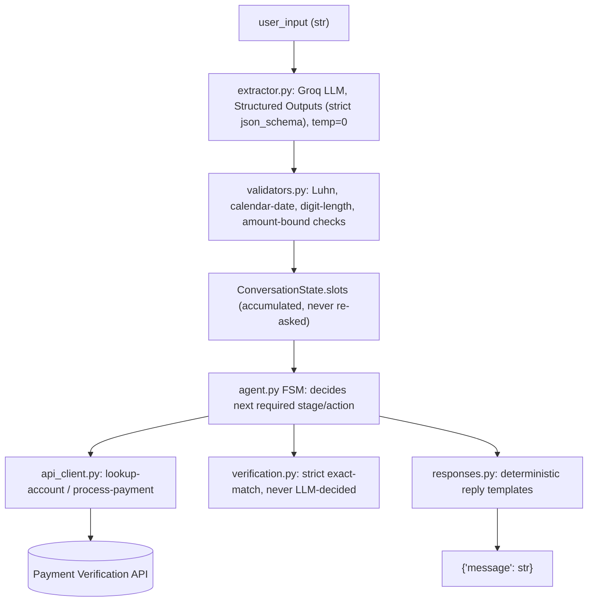

# Design Document — Payment Collection AI Agent

## 1. Architecture Overview

The agent is a deterministic finite-state machine (`agent.py`) with exactly one non-deterministic component plugged into it: an LLM-based slot extractor (`extractor.py`). Everything that must be strict, auditable, and repeatable — conversation flow, retry limits, the verification decision, API calls, and every word the user sees — is plain Python. The LLM's only job is turning one free-form message into structured data.

Module responsibilities:

- **`agent.py`** — the required `Agent.next()` interface. Owns `ConversationState` and dispatches to one handler per `Stage` (account id → name → secondary factor → amount → card details → closed). A handler either asks the user for something (returns a message, stays put) or makes internal progress and signals the loop to immediately re-dispatch into the next stage within the same turn — this is what lets out-of-order or front-loaded information collapse several stages into one reply instead of forcing redundant questions.
- **`extractor.py`** — the only place natural-language understanding happens. See §2.
- **`validators.py`** — Luhn check, calendar-date validity, digit-length checks, amount bounds, expiry validity. Pure functions, no I/O.
- **`verification.py`** — one pure function, exact-match only.
- **`api_client.py`** — thin `requests` wrapper for `lookup-account`/`process-payment`; distinguishes documented 4xx business outcomes from unexpected failures (timeouts/5xx), and keeps an append-only, card-data-masked call log used by the eval harness.
- **`responses.py`** — every user-facing string, centralized so the entire reply surface can be audited in one place for PII leakage.
- **`state.py`** — `Stage` enum, `Slots`/`ConversationState` dataclasses, retry-limit constants, and `current_ask_description()` (see §2).

## 2. Key Decisions & Why

**LLM-first extraction, not regex-first.** The initial instinct was regex/heuristics first with the LLM as a fallback for ambiguous cases. Two concrete inputs discussed during design broke that: a CVV given as `"two hunder sixty 5"` (a typo *and* a mixed word/digit format — a word→digit dictionary lookup fails outright on the misspelling), and a DOB given as `"22 september 2003. Oh sorry its 22 September 2002"` (two valid, parseable dates in one message — resolving which one the user meant requires understanding "oh sorry", not a bigger regex). Both are language-understanding problems, not parsing problems, so the LLM became the primary extraction path rather than a fallback.

**Structured Outputs (`strict: true`) over free-form JSON prompting.** `openai/gpt-oss-120b` on Groq supports schema-constrained decoding: the response is *guaranteed* to match `SLOT_SCHEMA` exactly (every field present, correct types, no extras). This removes the entire "malformed JSON" failure class rather than defending against it, and is why there is no regex/text-scraping fallback for parsing the LLM's own response.

**The safety net stays deterministic.** Schema-valid is not the same as business-valid or identity-valid, so nothing the LLM returns is trusted directly:
- Every value passes through `validators.py` (Luhn, calendar-date reality, digit lengths, amount bounds) before being used.
- The verification decision (`verification.py`) is plain exact-string equality against the account record fetched from `lookup-account`. The LLM only ever proposes what the user typed; it never decides whether it matches.
- All retry counting, business rules, API calls, and reply wording are template-driven Python.

**Ask-context disambiguation (found via testing, not designed upfront).** Early manual testing surfaced a real bug: once the user's name was already known (locked in after verification), asking "could you share your cardholder name?" and getting back a bare `"Nithin Jain"` caused the LLM to (reasonably) attribute it to the already-known `full_name` field instead of `cardholder_name`, since nothing told it which field was actually being asked about — the agent looped forever re-asking. Fixed two ways: (1) `state.current_ask_description()` tells the extractor in plain language what the agent just asked for, so bare replies are attributed correctly; (2) as a deterministic backstop independent of LLM behavior, `agent.py` only ever merges `cardholder_name` into slots once `state.verified` is `True` — pre-verification, any name-shaped input is structurally only ever treated as `full_name`. This is the clearest example in the codebase of the general principle: use the LLM for language understanding, but never let a single LLM misjudgment be the only thing standing between input and an incorrect state change.

**Out-of-order data is captured everywhere, acted on only in order.** Extraction runs on every message regardless of current stage and fills whatever slots it can (e.g. a card number volunteered before the account ID is even known). The FSM still enforces required order for *actions* — no verification is skipped, no payment is attempted early — but already-known slots are never re-asked for once their stage is reached.

**Balance-sharing is a one-time prefix, not a stage.** Because verified users can already have an amount/card details queued up from earlier in the conversation, "share the balance" is implemented as a one-shot prefix appended the first time `AWAITING_AMOUNT` is entered, rather than a message that blocks progress — so a user who front-loads everything still sees their balance exactly once, in the right place, without an extra round-trip.

## 3. Tradeoffs Accepted

- **Availability is coupled to Groq's.** There is no regex/heuristic fallback for extraction itself (only retry-with-backoff on transient call failures, then a "please resend" message, then a terminal close after repeated failures). This was a deliberate choice after concluding that a regex fallback could not handle the input classes that motivated using an LLM in the first place, and a fallback that only covers the *easy* cases while silently failing on hard ones is worse than a clear, honest "I'm having trouble" message.
- **LLM determinism is "highly consistent," not byte-for-byte guaranteed.** `temperature=0` plus Structured Outputs makes behavior very stable in practice, but provider-side inference is not architecturally guaranteed to be bit-identical across calls. This is mitigated by keeping every decision that must be strict (verification, retry limits, business rules) in code that only *consumes* the LLM's output, so extraction-level variance can at most cause an extra clarifying question, never an incorrect verification or payment outcome.
- **`cardholder_name` is never captured before verification, even if volunteered.** A user who states their card's name very early will have it ignored until after verification, by design — a small UX cost for a stronger correctness guarantee.
- **Local pre-validation before hitting the API.** Card fields are Luhn/expiry/CVV-length-checked locally before any `process-payment` call, trading a small amount of duplicated validation logic (the API validates the same things) for faster, clearer feedback and fewer wasted API calls.

## 4. Assumptions

- Retry limits: 3 attempts for account lookup, 3 for verification, 3 for payment attempts — centralized as constants in `state.py`.
- A closed `Agent` instance does not reopen; starting over means creating a new `Agent()`, which satisfies "no manual state resets" (the session itself just ends cleanly rather than requiring an external reset call).
- The "collect card payment details" step includes the payment amount (needed to support partial payments), asked before the card fields themselves.
- Network/5xx/unexpected errors from either API are treated as terminal for that session (apologize, suggest retrying later) rather than silently retried, since the agent has no way to know if a partially-failed request already had a side effect.
- `.env` holding the real Groq key is not committed to the repo; `.env.example` documents `GROQ_API_KEY` / `GROQ_MODEL` / `PAYMENT_API_BASE_URL`.

## 5. Evaluation Approach

Two complementary layers, per the requirement to test happy path, verification failure, payment failure, and edge cases:

- **`tests/`** (51 tests, `pytest`) — fast, offline, deterministic checks: `validators`/`verification`/`state` as pure functions; `api_client` against a mocked `requests.post` (status-code branching, payload shape, and that raw card number/CVV never reach the call log); `extractor` error-handling against a fake Groq client (retry/backoff/exhaustion, no network); `test_fsm_flow.py` drives the real `Agent` against the real `lookup-account`/`process-payment` API with the extractor swapped for a deterministic stub, so FSM/verification/business-rule correctness is graded independent of LLM availability; `test_extractor_live.py` hits the real Groq API for the specific hard NLU cases (typo'd CVV, self-correcting DOB, nickname vs. full name, spelled-out amounts) and skips gracefully rather than failing if the LLM is unreachable.
- **`eval/`** — end-to-end evaluation against the fully real system (real Groq extraction + real API), producing both a pass/fail report and `eval/sample_conversations.md` (doubling as the sample-conversations deliverable). 11 scripted cases cover: happy path full/partial payment, verification failure exhausting retries, verification via each secondary factor, account-not-found-then-corrected, insufficient balance, invalid-card-then-corrected, both leap-year cases (exact match and off-by-one), out-of-order information, mid-flow cancellation, and a dedicated "messy extraction stress test" combining the typo'd-CVV and self-correcting-DOB cases. Each case defines what "correct" means explicitly: expected terminal outcome, expected ordered sequence of API calls, and a PII-leak scan of every reply. Latest run: **11/11 cases, 39/39 individual checks passed.**

**Where the agent struggles / observations:** the one real failure mode found during development was the ask-context ambiguity described in §2 (a name-shaped answer being attributed to the wrong slot when a same-looking value is already known under a different field) — now mitigated with both a prompt-level fix and a deterministic stage-gate, but it's a good illustration that any slot whose *type* overlaps with another slot's type (name-shaped values, in this case) needs explicit disambiguation context rather than relying on the schema field descriptions alone. Given more time, the next thing worth stress-testing is multiple simultaneous corrections across non-adjacent turns (e.g. correcting the account ID two turns after verification has already started) and adversarial inputs aimed at the verification step specifically (e.g. a user trying to brute-force a secondary factor).

## 6. What I'd Improve With More Time

- Replace the hosted Groq call with a small local fine-tuned LLM for extraction. The slot-extraction task itself isn't very complex (fixed schema, short input, narrow domain), so a small model fine-tuned specifically on this schema/task could match accuracy while running locally cutting both per-turn latency (no network round-trip) and ongoing inference cost (no per-token API billing), and removing the agent's availability coupling to a third-party provider entirely.
- Add a small persistence layer (even just serializing `ConversationState`) so a session could survive a process restart — currently state is purely in-memory for the lifetime of one `Agent` instance, which matches the required interface but wouldn't survive a real deployment restart.
- Expand the eval harness with adversarial/fuzz-style cases (deliberately contradictory information, rapid topic switching, attempted prompt injection through user input into the extractor) to pressure-test the deterministic guardrails further.
- Track and expose lightweight per-session metrics (turns taken, retries used, extraction latency) from the `Agent` itself, so a real deployment could monitor these without needing the external eval harness.
- Consider rate-limiting/backoff tuning for the Groq client under real concurrent load, since the current retry policy (2 retries, linear backoff) was chosen for a single-session take-home context rather than production traffic.
